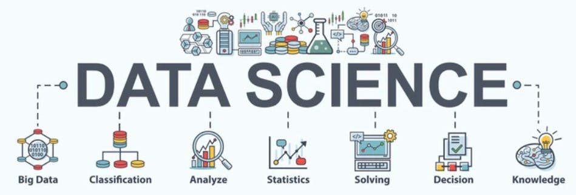

# **Ciência de Dados (Data Science)**

A ciência de dados combina vários campos, incluindo estatísticas, métodos científicos e análise de dados para extrair valor dos dados.
Como a tecnologia moderna permitiu a criação e armazenamento de quantidades crescentes de informações, os volumes de dados explodiram.
A riqueza de dados coletados e armazenados por essas tecnologias pode trazer benefícios transformadores para organizações e sociedades em todo o mundo, mas somente se pudermos interpretá-los.

A ciência de dados revela tendências e produz as informações que as empresas podem usar para tomar melhores decisões e criar produtos e serviços mais inovadores. 
Ela permite que os modelos de machine learning (ML) aprendam com as grandes quantidades de dados que estão sendo fornecidos a eles, 
em vez de depender principalmente de analistas de negócios para ver o que podem descobrir a partir dos dados.

Os projetos de ciência de dados apresentados aqui são:

* rotatividade_clientes: Determina a rotatividade de clientes analisando os dados de uma empresa fictícia de telecomunicações, para que o marketing possa tomar medidas para retê-los.

* recomendaçao_ecommerce: Sistema de recomendação desenvolvido para melhorar as vendas em um site, baseado na jornada de um novo cliente desde o momento em que ele chega ao site da empresa pela primeira vez até quando ele faz compras repetidas.

* fluxo_clientes: Projeto que usa modelos estatísticos para prever o fluxo de clientes em um estabelecimento, para que seja contratados funcionários temporários em situalções de grande demanda de clientes.

* demanda_itens_loja: Analisa, prevê e otimiza as vendas dos produtos de diferentes lojas para os próximos meses.

* consumo_cerveja_sp: Projeto criado para determinar quanta cerveja será consumida em um dia em um bar universitário de São Paulo, garantindo um controle de estoque da bebida.
